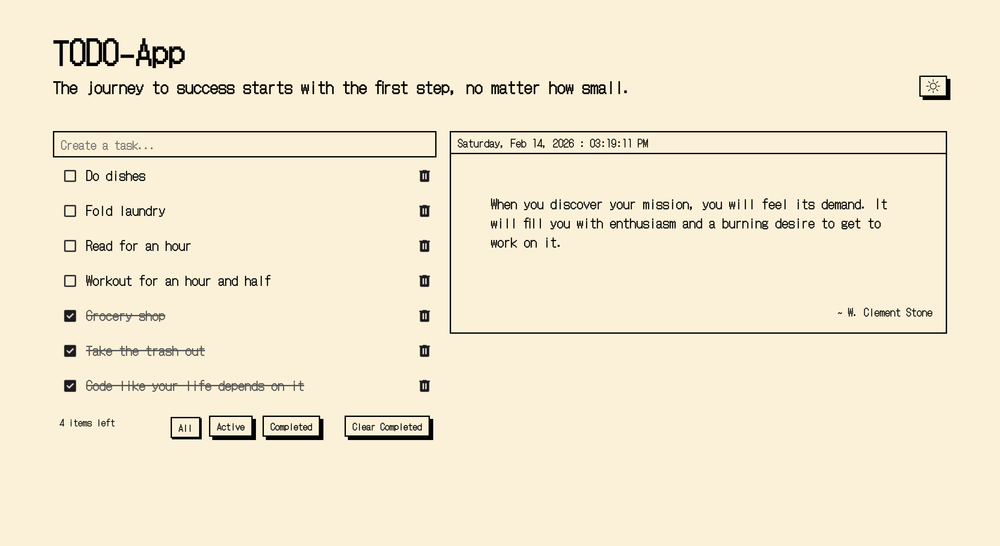
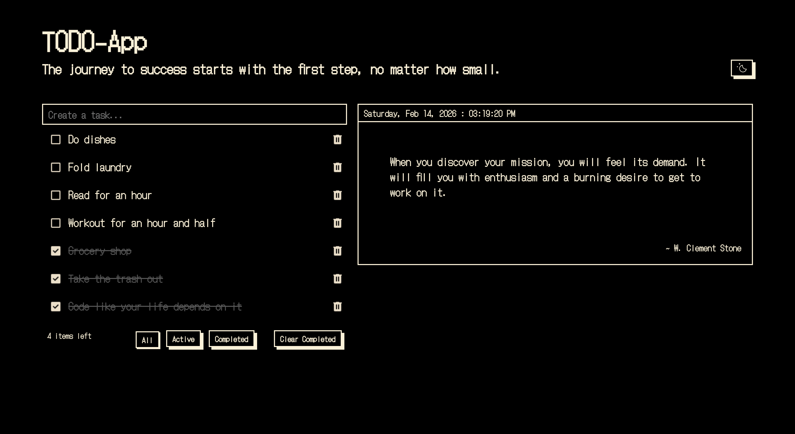

<div align="center">
  <br />
      
      
    </a>
  <br />
</div>

<h3 align="center">ToDo App</h3>

# Welcome to my App 👋

This is my responsive retro-inspired Todo app built with vanilla JavaScript (Vite) to practice OOP, DOM rendering, and state management. Unlike typical Todo apps, this project integrates dynamic motivational quotes to reinforce progress and consistency while completing daily tasks.

## Features

- Add tasks using the input + `Enter` key.
- Toggle task completion with a checkbox button.
- Delete tasks with a delete button.
- Filter tasks by:
  - `All`
  - `Active`
  - `Completed`
- Clear all completed tasks with `Clear Completed`.
- Live task counter (`items left`) based on incomplete tasks.
- Data persistence with `localStorage` ( so that tasks remain after refresh).
- Theme toggle (light/dark).
- Theme preference persistence with `localStorage`.
- Responsive layout for desktop and mobile.

## Project Goals

- Practice OOP in JavaScript.
- Separate concerns between:
  - data model (`Todo`)
  - persistence (`TodoStore`)
  - UI/events (`TodoApp`)
- Learn event delegation and dynamic rendering.
- Build feature-by-feature with maintainable methods.

## Tech Stack

- HTML
- CSS
- JavaScript
- Vite

## Architecture

- `Todo`
  - Represents a single task (`id`, `text`, `completed`).
  - Handles completion toggle.
- `TodoStore`
  - Reads/writes todos from/to `localStorage`.
- `TodoApp`
  - Owns app state, event bindings, filtering, rendering, theme logic, and UI updates.

## State Flow

1. User action triggers an event (`add`, `toggle`, `delete`, `filter`, `clear`, `theme`).
2. App state updates in memory.
3. Persistent state is saved (`localStorage`) when needed.
4. `render()` updates the DOM from current state.

## Learning Highlights

- Event delegation for list actions using `data-action`.
- Dynamic DOM creation via `createTodoElement`.
- Conditional rendering via `currentFilter`.
- Defensive loading with JSON parse fallback.
- Theme application through root-level theme state + CSS variables.

## Future Improvements

- Robust API error UI and loading state.
- Optional backend proxy for quote APIs with CORS restrictions.
- Accessibility improvements (ARIA labels, keyboard focus states).
- Drag-and-drop task ordering.

## Installation Guide

```bash
npm install
npm run dev
